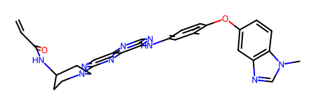

# RDKit ligand


<!-- WARNING: THIS FILE WAS AUTOGENERATED! DO NOT EDIT! -->

## Setup

------------------------------------------------------------------------

<a
href="https://github.com/sky1ove/kdock/blob/main/kdock/core/ligand.py#L21"
target="_blank" style="float:right; font-size:smaller">source</a>

### contain_acrylamide

``` python

def contain_acrylamide(
    smiles, ACRYLAMIDE_SMARTS:str='C=CC(=O)N', # SMARTS pattern for acrylamide
):

```

*Check if the SMILES contain acrylamide (can form covalent bond with
cysteine in protein)*

``` python
# df['covalent'] = df.SMILES.apply(contain_acrylamide)
```

------------------------------------------------------------------------

<a
href="https://github.com/sky1ove/kdock/blob/main/kdock/core/ligand.py#L31"
target="_blank" style="float:right; font-size:smaller">source</a>

### plot_drug

``` python

def plot_drug(
    drug_dict, flip_list:NoneType=None, save_path:NoneType=None
):

```

*Call self as a function.*

``` python
drug_smiles = {
    "Capmatinib": "CNC(=O)C1=C(C=C(C=C1)C2=NN3C(=CN=C3N=C2)CC4=CC5=C(C=C4)N=CC=C5)F",
    "Tepotinib": "CN1CCC(CC1)COC2=CN=C(N=C2)C3=CC=CC(=C3)CN4C(=O)C=CC(=N4)C5=CC=CC(=C5)C#N",}

flip_list = ['Tepotinib'] # indicate keys to flip horizontally
plot_drug(drug_smiles,
          flip_list=flip_list,
        #   save_path='drug_structures.svg'
          )
```

## Conformer

------------------------------------------------------------------------

<a
href="https://github.com/sky1ove/kdock/blob/main/kdock/core/ligand.py#L70"
target="_blank" style="float:right; font-size:smaller">source</a>

### rdkit_conformer

``` python

def rdkit_conformer(
    SMILES, # SMILES string
    output:NoneType=None, # file ".sdf" to be saved
    method:str='ETKDG', # Optimization method, can be 'UFF', 'MMFF' or 'ETKDGv3'
    visualize:bool=True, # whether or not to visualize the compound
    seed:int=3, # randomness of the 3D conformation
):

```

*Gemerate 3D conformers from SMILES*

``` python
rdkit_conformer('CC1=C(C=CC(=C1)NC2=NC=NC3=CN=C(N=C32)N4CCC(CC4)NC(=O)C=C)OC5=CC6=C(C=C5)N(C=N6)C')
```



------------------------------------------------------------------------

<a
href="https://github.com/sky1ove/kdock/blob/main/kdock/core/ligand.py#L113"
target="_blank" style="float:right; font-size:smaller">source</a>

### tanimoto

``` python

def tanimoto(
    df, # df with SMILES and ID columns
    smiles_col:str='SMILES', # colname of SMILES
    id_col:str='ID', # colname of compound ID
    target_col:NoneType=None, # colname of compound values (e.g., IC50)
    radius:int=2, # radius of the Morgan fingerprint.
):

```

*Calculates the Tanimoto similarity scores between all pairs of
molecules in a pandas DataFrame.*

``` python
df = Kras.get_mirati_g12d_raw()[['ID','SMILES','IC50']]
df = df.dropna(subset= 'IC50').reset_index(drop=True)
df
```

<div>
<style scoped>
    .dataframe tbody tr th:only-of-type {
        vertical-align: middle;
    }
&#10;    .dataframe tbody tr th {
        vertical-align: top;
    }
&#10;    .dataframe thead th {
        text-align: right;
    }
</style>

<table class="dataframe" data-quarto-postprocess="true" data-border="1">
<thead>
<tr style="text-align: right;">
<th data-quarto-table-cell-role="th"></th>
<th data-quarto-table-cell-role="th">ID</th>
<th data-quarto-table-cell-role="th">SMILES</th>
<th data-quarto-table-cell-role="th">IC50</th>
</tr>
</thead>
<tbody>
<tr>
<td data-quarto-table-cell-role="th">0</td>
<td>US_1</td>
<td>CN1CCC[C@H]1COc1nc(N2CC3CCC(C2)N3)c2cnc(cc2n1)...</td>
<td>124.7</td>
</tr>
<tr>
<td data-quarto-table-cell-role="th">1</td>
<td>US_2</td>
<td>CN1CCC[C@H]1COc1nc(N2CC3CCC(C2)N3)c2cnc(c(F)c2...</td>
<td>2.7</td>
</tr>
<tr>
<td data-quarto-table-cell-role="th">...</td>
<td>...</td>
<td>...</td>
<td>...</td>
</tr>
<tr>
<td data-quarto-table-cell-role="th">703</td>
<td>paper_37</td>
<td>FC1=C(C2=C(C(Cl)=CC=C3)C3=CC(O)=C2)N=CC4=C1N=C...</td>
<td>2.0</td>
</tr>
<tr>
<td data-quarto-table-cell-role="th">704</td>
<td>paper_38</td>
<td>FC1=C(C2=C(C(C#C)=CC=C3)C3=CC(O)=C2)N=CC4=C1N=...</td>
<td>2.0</td>
</tr>
</tbody>
</table>

<p>705 rows × 3 columns</p>
</div>

``` python
result = tanimoto(df.head(), target_col = 'IC50')
result
```

<div>
<style scoped>
    .dataframe tbody tr th:only-of-type {
        vertical-align: middle;
    }
&#10;    .dataframe tbody tr th {
        vertical-align: top;
    }
&#10;    .dataframe thead th {
        text-align: right;
    }
</style>

<table class="dataframe" data-quarto-postprocess="true" data-border="1">
<thead>
<tr style="text-align: right;">
<th data-quarto-table-cell-role="th"></th>
<th data-quarto-table-cell-role="th">ID1</th>
<th data-quarto-table-cell-role="th">ID2</th>
<th data-quarto-table-cell-role="th">SMILES1</th>
<th data-quarto-table-cell-role="th">SMILES2</th>
<th data-quarto-table-cell-role="th">SimilarityScore</th>
<th data-quarto-table-cell-role="th">Target1</th>
<th data-quarto-table-cell-role="th">Target2</th>
</tr>
</thead>
<tbody>
<tr>
<td data-quarto-table-cell-role="th">0</td>
<td>US_3</td>
<td>US_4</td>
<td>Cn1ccnc1CCOc1nc(N2CC3CCC(C2)N3)c2cnc(c(F)c2n1)...</td>
<td>Oc1cc(-c2ncc3c(nc(OCCc4ccccn4)nc3c2F)N2CC3CCC(...</td>
<td>0.779221</td>
<td>9.5</td>
<td>496.2</td>
</tr>
<tr>
<td data-quarto-table-cell-role="th">1</td>
<td>US_1</td>
<td>US_2</td>
<td>CN1CCC[C@H]1COc1nc(N2CC3CCC(C2)N3)c2cnc(cc2n1)...</td>
<td>CN1CCC[C@H]1COc1nc(N2CC3CCC(C2)N3)c2cnc(c(F)c2...</td>
<td>0.743590</td>
<td>124.7</td>
<td>2.7</td>
</tr>
<tr>
<td data-quarto-table-cell-role="th">...</td>
<td>...</td>
<td>...</td>
<td>...</td>
<td>...</td>
<td>...</td>
<td>...</td>
<td>...</td>
</tr>
<tr>
<td data-quarto-table-cell-role="th">8</td>
<td>US_1</td>
<td>US_3</td>
<td>CN1CCC[C@H]1COc1nc(N2CC3CCC(C2)N3)c2cnc(cc2n1)...</td>
<td>Cn1ccnc1CCOc1nc(N2CC3CCC(C2)N3)c2cnc(c(F)c2n1)...</td>
<td>0.505495</td>
<td>124.7</td>
<td>9.5</td>
</tr>
<tr>
<td data-quarto-table-cell-role="th">9</td>
<td>US_1</td>
<td>US_4</td>
<td>CN1CCC[C@H]1COc1nc(N2CC3CCC(C2)N3)c2cnc(cc2n1)...</td>
<td>Oc1cc(-c2ncc3c(nc(OCCc4ccccn4)nc3c2F)N2CC3CCC(...</td>
<td>0.488889</td>
<td>124.7</td>
<td>496.2</td>
</tr>
</tbody>
</table>

<p>10 rows × 7 columns</p>
</div>

## Rdkit feature

------------------------------------------------------------------------

<a
href="https://github.com/sky1ove/kdock/blob/main/kdock/core/ligand.py#L151"
target="_blank" style="float:right; font-size:smaller">source</a>

### get_rdkit

``` python

def get_rdkit(
    SMILES:str
):

```

*Extract chemical features from SMILES* Reference:
https://greglandrum.github.io/rdkit-blog/posts/2022-12-23-descriptor-tutorial.html

------------------------------------------------------------------------

<a
href="https://github.com/sky1ove/kdock/blob/main/kdock/core/ligand.py#L160"
target="_blank" style="float:right; font-size:smaller">source</a>

### get_rdkit_3d

``` python

def get_rdkit_3d(
    SMILES:str
):

```

*Extract 3d features from SMILES*

------------------------------------------------------------------------

<a
href="https://github.com/sky1ove/kdock/blob/main/kdock/core/ligand.py#L169"
target="_blank" style="float:right; font-size:smaller">source</a>

### get_rdkit_all

``` python

def get_rdkit_all(
    SMILES:str
):

```

*Extract chemical features and 3d features from SMILES*

------------------------------------------------------------------------

<a
href="https://github.com/sky1ove/kdock/blob/main/kdock/core/ligand.py#L176"
target="_blank" style="float:right; font-size:smaller">source</a>

### remove_hi_corr

``` python

def remove_hi_corr(
    df:DataFrame, thr:float=0.99, # threshold
):

```

*Remove highly correlated features in a dataframe given a pearson
threshold*

------------------------------------------------------------------------

<a
href="https://github.com/sky1ove/kdock/blob/main/kdock/core/ligand.py#L186"
target="_blank" style="float:right; font-size:smaller">source</a>

### preprocess

``` python

def preprocess(
    df:DataFrame, thr:float=0.99
):

```

*Remove features with no variance, and highly correlated features based
on threshold.*

------------------------------------------------------------------------

<a
href="https://github.com/sky1ove/kdock/blob/main/kdock/core/ligand.py#L211"
target="_blank" style="float:right; font-size:smaller">source</a>

### get_rdkit_df

``` python

def get_rdkit_df(
    df:DataFrame, include_3d:bool=False, col:str='SMILES', postprocess:bool=False,
    chunksize:int=128, # for parallel process_map
):

```

*Extract rdkit features (optionally in parallel with 3D) from SMILES in
a df*

``` python
df=Collins.get_antibiotics_2k().head(300)
df.head()
```

<div>
<style scoped>
    .dataframe tbody tr th:only-of-type {
        vertical-align: middle;
    }
&#10;    .dataframe tbody tr th {
        vertical-align: top;
    }
&#10;    .dataframe thead th {
        text-align: right;
    }
</style>

<table class="dataframe" data-quarto-postprocess="true" data-border="1">
<thead>
<tr style="text-align: right;">
<th data-quarto-table-cell-role="th"></th>
<th data-quarto-table-cell-role="th">name</th>
<th data-quarto-table-cell-role="th">SMILES</th>
<th data-quarto-table-cell-role="th">inhibition</th>
<th data-quarto-table-cell-role="th">activity</th>
</tr>
</thead>
<tbody>
<tr>
<td data-quarto-table-cell-role="th">0</td>
<td>CEFPIRAMIDE</td>
<td>Cc1cc(O)c(C(=O)NC(C(=O)NC2C(=O)N3C(C(=O)O)=C(C...</td>
<td>0.041572</td>
<td>1</td>
</tr>
<tr>
<td data-quarto-table-cell-role="th">1</td>
<td>GEMIFLOXACIN MESYLATE</td>
<td>CON=C1CN(c2nc3c(cc2F)c(=O)c(C(=O)O)cn3C2CC2)CC...</td>
<td>0.041876</td>
<td>1</td>
</tr>
<tr>
<td data-quarto-table-cell-role="th">2</td>
<td>POLYMYXIN B SULFATE</td>
<td>CCC(C)CCCCC(=O)NC(CCN)C(=O)NC(C(=O)NC(CCN)C(=O...</td>
<td>0.041916</td>
<td>1</td>
</tr>
<tr>
<td data-quarto-table-cell-role="th">3</td>
<td>PRAXADINE HYDROCHLORIDE</td>
<td>Cl.N=C(N)n1cccn1</td>
<td>0.041964</td>
<td>1</td>
</tr>
<tr>
<td data-quarto-table-cell-role="th">4</td>
<td>CHLORHEXIDINE DIHYDROCHLORIDE</td>
<td>Cl.Cl.N=C(NCCCCCCNC(=N)NC(=N)Nc1ccc(Cl)cc1)NC(...</td>
<td>0.042295</td>
<td>1</td>
</tr>
</tbody>
</table>

</div>

``` python
# %%time
# feat_raw=get_rdkit_df(df)
# feat_raw
```

      0%|          | 0/300 [00:00<?, ?it/s]

    CPU times: user 46.6 ms, sys: 65.7 ms, total: 112 ms
    Wall time: 2.63 s

<div>
<style scoped>
    .dataframe tbody tr th:only-of-type {
        vertical-align: middle;
    }
&#10;    .dataframe tbody tr th {
        vertical-align: top;
    }
&#10;    .dataframe thead th {
        text-align: right;
    }
</style>

<table class="dataframe" data-quarto-postprocess="true" data-border="1">
<thead>
<tr style="text-align: right;">
<th data-quarto-table-cell-role="th"></th>
<th data-quarto-table-cell-role="th">MaxAbsEStateIndex</th>
<th data-quarto-table-cell-role="th">MaxEStateIndex</th>
<th data-quarto-table-cell-role="th">MinAbsEStateIndex</th>
<th data-quarto-table-cell-role="th">MinEStateIndex</th>
<th data-quarto-table-cell-role="th">qed</th>
<th data-quarto-table-cell-role="th">SPS</th>
<th data-quarto-table-cell-role="th">MolWt</th>
<th data-quarto-table-cell-role="th">HeavyAtomMolWt</th>
<th data-quarto-table-cell-role="th">ExactMolWt</th>
<th data-quarto-table-cell-role="th">NumValenceElectrons</th>
<th data-quarto-table-cell-role="th">NumRadicalElectrons</th>
<th data-quarto-table-cell-role="th">MaxPartialCharge</th>
<th data-quarto-table-cell-role="th">MinPartialCharge</th>
<th data-quarto-table-cell-role="th">MaxAbsPartialCharge</th>
<th data-quarto-table-cell-role="th">MinAbsPartialCharge</th>
<th data-quarto-table-cell-role="th">FpDensityMorgan1</th>
<th data-quarto-table-cell-role="th">FpDensityMorgan2</th>
<th data-quarto-table-cell-role="th">FpDensityMorgan3</th>
<th data-quarto-table-cell-role="th">BCUT2D_MWHI</th>
<th data-quarto-table-cell-role="th">BCUT2D_MWLOW</th>
<th data-quarto-table-cell-role="th">BCUT2D_CHGHI</th>
<th data-quarto-table-cell-role="th">BCUT2D_CHGLO</th>
<th data-quarto-table-cell-role="th">BCUT2D_LOGPHI</th>
<th data-quarto-table-cell-role="th">BCUT2D_LOGPLOW</th>
<th data-quarto-table-cell-role="th">BCUT2D_MRHI</th>
<th data-quarto-table-cell-role="th">BCUT2D_MRLOW</th>
<th data-quarto-table-cell-role="th">AvgIpc</th>
<th data-quarto-table-cell-role="th">BalabanJ</th>
<th data-quarto-table-cell-role="th">BertzCT</th>
<th data-quarto-table-cell-role="th">Chi0</th>
<th data-quarto-table-cell-role="th">Chi0n</th>
<th data-quarto-table-cell-role="th">Chi0v</th>
<th data-quarto-table-cell-role="th">Chi1</th>
<th data-quarto-table-cell-role="th">Chi1n</th>
<th data-quarto-table-cell-role="th">Chi1v</th>
<th data-quarto-table-cell-role="th">Chi2n</th>
<th data-quarto-table-cell-role="th">Chi2v</th>
<th data-quarto-table-cell-role="th">Chi3n</th>
<th data-quarto-table-cell-role="th">Chi3v</th>
<th data-quarto-table-cell-role="th">Chi4n</th>
<th data-quarto-table-cell-role="th">Chi4v</th>
<th data-quarto-table-cell-role="th">HallKierAlpha</th>
<th data-quarto-table-cell-role="th">Ipc</th>
<th data-quarto-table-cell-role="th">Kappa1</th>
<th data-quarto-table-cell-role="th">Kappa2</th>
<th data-quarto-table-cell-role="th">Kappa3</th>
<th data-quarto-table-cell-role="th">LabuteASA</th>
<th data-quarto-table-cell-role="th">PEOE_VSA1</th>
<th data-quarto-table-cell-role="th">PEOE_VSA10</th>
<th data-quarto-table-cell-role="th">PEOE_VSA11</th>
<th data-quarto-table-cell-role="th">...</th>
<th data-quarto-table-cell-role="th">fr_benzodiazepine</th>
<th data-quarto-table-cell-role="th">fr_bicyclic</th>
<th data-quarto-table-cell-role="th">fr_diazo</th>
<th data-quarto-table-cell-role="th">fr_dihydropyridine</th>
<th data-quarto-table-cell-role="th">fr_epoxide</th>
<th data-quarto-table-cell-role="th">fr_ester</th>
<th data-quarto-table-cell-role="th">fr_ether</th>
<th data-quarto-table-cell-role="th">fr_furan</th>
<th data-quarto-table-cell-role="th">fr_guanido</th>
<th data-quarto-table-cell-role="th">fr_halogen</th>
<th data-quarto-table-cell-role="th">fr_hdrzine</th>
<th data-quarto-table-cell-role="th">fr_hdrzone</th>
<th data-quarto-table-cell-role="th">fr_imidazole</th>
<th data-quarto-table-cell-role="th">fr_imide</th>
<th data-quarto-table-cell-role="th">fr_isocyan</th>
<th data-quarto-table-cell-role="th">fr_isothiocyan</th>
<th data-quarto-table-cell-role="th">fr_ketone</th>
<th data-quarto-table-cell-role="th">fr_ketone_Topliss</th>
<th data-quarto-table-cell-role="th">fr_lactam</th>
<th data-quarto-table-cell-role="th">fr_lactone</th>
<th data-quarto-table-cell-role="th">fr_methoxy</th>
<th data-quarto-table-cell-role="th">fr_morpholine</th>
<th data-quarto-table-cell-role="th">fr_nitrile</th>
<th data-quarto-table-cell-role="th">fr_nitro</th>
<th data-quarto-table-cell-role="th">fr_nitro_arom</th>
<th data-quarto-table-cell-role="th">fr_nitro_arom_nonortho</th>
<th data-quarto-table-cell-role="th">fr_nitroso</th>
<th data-quarto-table-cell-role="th">fr_oxazole</th>
<th data-quarto-table-cell-role="th">fr_oxime</th>
<th data-quarto-table-cell-role="th">fr_para_hydroxylation</th>
<th data-quarto-table-cell-role="th">fr_phenol</th>
<th data-quarto-table-cell-role="th">fr_phenol_noOrthoHbond</th>
<th data-quarto-table-cell-role="th">fr_phos_acid</th>
<th data-quarto-table-cell-role="th">fr_phos_ester</th>
<th data-quarto-table-cell-role="th">fr_piperdine</th>
<th data-quarto-table-cell-role="th">fr_piperzine</th>
<th data-quarto-table-cell-role="th">fr_priamide</th>
<th data-quarto-table-cell-role="th">fr_prisulfonamd</th>
<th data-quarto-table-cell-role="th">fr_pyridine</th>
<th data-quarto-table-cell-role="th">fr_quatN</th>
<th data-quarto-table-cell-role="th">fr_sulfide</th>
<th data-quarto-table-cell-role="th">fr_sulfonamd</th>
<th data-quarto-table-cell-role="th">fr_sulfone</th>
<th data-quarto-table-cell-role="th">fr_term_acetylene</th>
<th data-quarto-table-cell-role="th">fr_tetrazole</th>
<th data-quarto-table-cell-role="th">fr_thiazole</th>
<th data-quarto-table-cell-role="th">fr_thiocyan</th>
<th data-quarto-table-cell-role="th">fr_thiophene</th>
<th data-quarto-table-cell-role="th">fr_unbrch_alkane</th>
<th data-quarto-table-cell-role="th">fr_urea</th>
</tr>
</thead>
<tbody>
<tr>
<td data-quarto-table-cell-role="th">0</td>
<td>13.503995</td>
<td>13.503995</td>
<td>0.064423</td>
<td>-1.323430</td>
<td>0.162954</td>
<td>18.619048</td>
<td>612.650</td>
<td>588.458</td>
<td>612.120937</td>
<td>218</td>
<td>0</td>
<td>0.352159</td>
<td>-0.507967</td>
<td>0.507967</td>
<td>0.352159</td>
<td>1.214286</td>
<td>1.952381</td>
<td>2.595238</td>
<td>32.167943</td>
<td>10.004034</td>
<td>2.541608</td>
<td>-2.492828</td>
<td>2.413335</td>
<td>-2.707792</td>
<td>8.005500</td>
<td>-0.150504</td>
<td>3.369454</td>
<td>1.339505e+00</td>
<td>1610.181663</td>
<td>30.128663</td>
<td>22.084778</td>
<td>23.717771</td>
<td>20.044622</td>
<td>12.357347</td>
<td>14.391701</td>
<td>9.367961</td>
<td>11.415452</td>
<td>6.531851</td>
<td>8.968356</td>
<td>4.422333</td>
<td>6.757255</td>
<td>-4.64</td>
<td>2.012862e+09</td>
<td>28.873109</td>
<td>11.690583</td>
<td>5.597490</td>
<td>245.926226</td>
<td>25.953159</td>
<td>34.653617</td>
<td>0.000000</td>
<td>...</td>
<td>0</td>
<td>1</td>
<td>0</td>
<td>0</td>
<td>0</td>
<td>0</td>
<td>0</td>
<td>0</td>
<td>0</td>
<td>0</td>
<td>0</td>
<td>0</td>
<td>0</td>
<td>0</td>
<td>0</td>
<td>0</td>
<td>0</td>
<td>0</td>
<td>1</td>
<td>0</td>
<td>0</td>
<td>0</td>
<td>0</td>
<td>0</td>
<td>0</td>
<td>0</td>
<td>0</td>
<td>0</td>
<td>0</td>
<td>0</td>
<td>1</td>
<td>1</td>
<td>0</td>
<td>0</td>
<td>0</td>
<td>0</td>
<td>0</td>
<td>0</td>
<td>1</td>
<td>0</td>
<td>2</td>
<td>0</td>
<td>0</td>
<td>0</td>
<td>1</td>
<td>0</td>
<td>0</td>
<td>0</td>
<td>0</td>
<td>0</td>
</tr>
<tr>
<td data-quarto-table-cell-role="th">1</td>
<td>14.874521</td>
<td>14.874521</td>
<td>0.033885</td>
<td>-3.666667</td>
<td>0.398220</td>
<td>19.484848</td>
<td>485.494</td>
<td>461.302</td>
<td>485.138047</td>
<td>180</td>
<td>0</td>
<td>0.340725</td>
<td>-0.477497</td>
<td>0.477497</td>
<td>0.340725</td>
<td>1.424242</td>
<td>2.060606</td>
<td>2.575758</td>
<td>32.239615</td>
<td>10.092419</td>
<td>2.328029</td>
<td>-2.190189</td>
<td>2.370431</td>
<td>-2.256089</td>
<td>7.845502</td>
<td>0.069447</td>
<td>3.471950</td>
<td>5.549999e-07</td>
<td>1265.508949</td>
<td>24.499271</td>
<td>17.933021</td>
<td>18.749518</td>
<td>15.439091</td>
<td>9.902198</td>
<td>11.750510</td>
<td>7.791830</td>
<td>9.257870</td>
<td>5.167537</td>
<td>5.167537</td>
<td>3.595955</td>
<td>3.595955</td>
<td>-3.10</td>
<td>1.783676e+07</td>
<td>24.540619</td>
<td>9.407810</td>
<td>5.638555</td>
<td>187.744947</td>
<td>25.144793</td>
<td>18.320426</td>
<td>11.635084</td>
<td>...</td>
<td>0</td>
<td>1</td>
<td>0</td>
<td>0</td>
<td>0</td>
<td>0</td>
<td>0</td>
<td>0</td>
<td>0</td>
<td>1</td>
<td>0</td>
<td>0</td>
<td>0</td>
<td>0</td>
<td>0</td>
<td>0</td>
<td>0</td>
<td>0</td>
<td>0</td>
<td>0</td>
<td>0</td>
<td>0</td>
<td>0</td>
<td>0</td>
<td>0</td>
<td>0</td>
<td>0</td>
<td>0</td>
<td>1</td>
<td>0</td>
<td>0</td>
<td>0</td>
<td>0</td>
<td>0</td>
<td>0</td>
<td>0</td>
<td>0</td>
<td>0</td>
<td>2</td>
<td>0</td>
<td>0</td>
<td>0</td>
<td>0</td>
<td>0</td>
<td>0</td>
<td>0</td>
<td>0</td>
<td>0</td>
<td>0</td>
<td>0</td>
</tr>
<tr>
<td data-quarto-table-cell-role="th">...</td>
<td>...</td>
<td>...</td>
<td>...</td>
<td>...</td>
<td>...</td>
<td>...</td>
<td>...</td>
<td>...</td>
<td>...</td>
<td>...</td>
<td>...</td>
<td>...</td>
<td>...</td>
<td>...</td>
<td>...</td>
<td>...</td>
<td>...</td>
<td>...</td>
<td>...</td>
<td>...</td>
<td>...</td>
<td>...</td>
<td>...</td>
<td>...</td>
<td>...</td>
<td>...</td>
<td>...</td>
<td>...</td>
<td>...</td>
<td>...</td>
<td>...</td>
<td>...</td>
<td>...</td>
<td>...</td>
<td>...</td>
<td>...</td>
<td>...</td>
<td>...</td>
<td>...</td>
<td>...</td>
<td>...</td>
<td>...</td>
<td>...</td>
<td>...</td>
<td>...</td>
<td>...</td>
<td>...</td>
<td>...</td>
<td>...</td>
<td>...</td>
<td>...</td>
<td>...</td>
<td>...</td>
<td>...</td>
<td>...</td>
<td>...</td>
<td>...</td>
<td>...</td>
<td>...</td>
<td>...</td>
<td>...</td>
<td>...</td>
<td>...</td>
<td>...</td>
<td>...</td>
<td>...</td>
<td>...</td>
<td>...</td>
<td>...</td>
<td>...</td>
<td>...</td>
<td>...</td>
<td>...</td>
<td>...</td>
<td>...</td>
<td>...</td>
<td>...</td>
<td>...</td>
<td>...</td>
<td>...</td>
<td>...</td>
<td>...</td>
<td>...</td>
<td>...</td>
<td>...</td>
<td>...</td>
<td>...</td>
<td>...</td>
<td>...</td>
<td>...</td>
<td>...</td>
<td>...</td>
<td>...</td>
<td>...</td>
<td>...</td>
<td>...</td>
<td>...</td>
<td>...</td>
<td>...</td>
<td>...</td>
<td>...</td>
</tr>
<tr>
<td data-quarto-table-cell-role="th">298</td>
<td>11.161773</td>
<td>11.161773</td>
<td>0.278802</td>
<td>-0.471329</td>
<td>0.463380</td>
<td>10.423077</td>
<td>354.358</td>
<td>336.214</td>
<td>354.110338</td>
<td>134</td>
<td>0</td>
<td>0.307526</td>
<td>-0.426733</td>
<td>0.426733</td>
<td>0.307526</td>
<td>0.615385</td>
<td>1.038462</td>
<td>1.500000</td>
<td>16.546477</td>
<td>10.114910</td>
<td>2.058887</td>
<td>-2.069790</td>
<td>2.248839</td>
<td>-2.041320</td>
<td>5.751292</td>
<td>-0.132566</td>
<td>2.519358</td>
<td>2.225734e+00</td>
<td>814.855170</td>
<td>19.104084</td>
<td>14.645642</td>
<td>14.645642</td>
<td>12.312571</td>
<td>7.801219</td>
<td>7.801219</td>
<td>5.421051</td>
<td>5.421051</td>
<td>3.035442</td>
<td>3.035442</td>
<td>2.145140</td>
<td>2.145140</td>
<td>-3.41</td>
<td>4.201281e+05</td>
<td>18.921939</td>
<td>8.617804</td>
<td>6.238343</td>
<td>150.543633</td>
<td>14.210589</td>
<td>17.248535</td>
<td>0.000000</td>
<td>...</td>
<td>0</td>
<td>0</td>
<td>0</td>
<td>0</td>
<td>0</td>
<td>3</td>
<td>3</td>
<td>0</td>
<td>0</td>
<td>0</td>
<td>0</td>
<td>0</td>
<td>0</td>
<td>0</td>
<td>0</td>
<td>0</td>
<td>0</td>
<td>0</td>
<td>0</td>
<td>0</td>
<td>0</td>
<td>0</td>
<td>0</td>
<td>0</td>
<td>0</td>
<td>0</td>
<td>0</td>
<td>0</td>
<td>0</td>
<td>0</td>
<td>0</td>
<td>0</td>
<td>0</td>
<td>0</td>
<td>0</td>
<td>0</td>
<td>0</td>
<td>0</td>
<td>0</td>
<td>0</td>
<td>0</td>
<td>0</td>
<td>0</td>
<td>0</td>
<td>0</td>
<td>0</td>
<td>0</td>
<td>0</td>
<td>0</td>
<td>0</td>
</tr>
<tr>
<td data-quarto-table-cell-role="th">299</td>
<td>6.134942</td>
<td>6.134942</td>
<td>0.000000</td>
<td>0.000000</td>
<td>0.709648</td>
<td>16.421053</td>
<td>412.597</td>
<td>391.429</td>
<td>409.976001</td>
<td>108</td>
<td>0</td>
<td>0.050449</td>
<td>-0.397550</td>
<td>0.397550</td>
<td>0.050449</td>
<td>1.210526</td>
<td>1.842105</td>
<td>2.473684</td>
<td>79.919764</td>
<td>9.939734</td>
<td>2.186581</td>
<td>-2.311907</td>
<td>2.301302</td>
<td>-2.326367</td>
<td>9.108394</td>
<td>0.184585</td>
<td>2.360656</td>
<td>1.804999e-06</td>
<td>420.152146</td>
<td>13.120956</td>
<td>11.163433</td>
<td>15.151922</td>
<td>8.575387</td>
<td>6.513030</td>
<td>8.099027</td>
<td>5.167360</td>
<td>6.937372</td>
<td>3.797772</td>
<td>4.911697</td>
<td>2.688476</td>
<td>4.002186</td>
<td>0.23</td>
<td>1.225652e+04</td>
<td>17.282002</td>
<td>7.866121</td>
<td>4.622779</td>
<td>138.333022</td>
<td>5.733667</td>
<td>0.000000</td>
<td>0.000000</td>
<td>...</td>
<td>0</td>
<td>0</td>
<td>0</td>
<td>0</td>
<td>0</td>
<td>0</td>
<td>0</td>
<td>0</td>
<td>0</td>
<td>3</td>
<td>0</td>
<td>0</td>
<td>0</td>
<td>0</td>
<td>0</td>
<td>0</td>
<td>0</td>
<td>0</td>
<td>0</td>
<td>0</td>
<td>0</td>
<td>0</td>
<td>0</td>
<td>0</td>
<td>0</td>
<td>0</td>
<td>0</td>
<td>0</td>
<td>0</td>
<td>0</td>
<td>0</td>
<td>0</td>
<td>0</td>
<td>0</td>
<td>0</td>
<td>0</td>
<td>0</td>
<td>0</td>
<td>0</td>
<td>0</td>
<td>0</td>
<td>0</td>
<td>0</td>
<td>0</td>
<td>0</td>
<td>0</td>
<td>0</td>
<td>0</td>
<td>0</td>
<td>0</td>
</tr>
</tbody>
</table>

<p>300 rows × 210 columns</p>
</div>

``` python
# feat = get_rdkit_df(df,postprocess=True)
# feat
```

## Morgan fingerprints (ECFP)

Reference:

- [kaggle notebook,
  scikit-fingerprints](https://www.kaggle.com/code/michaszafarczyk/molecular-fingerprints-using-scikit-fingerprints)
- [scikit-fingerprints
  github](https://github.com/scikit-fingerprints/scikit-fingerprints)
- [kaggle notebook, fingerprint tips and
  tricks](https://www.kaggle.com/code/towardsentropy/fingerprint-tips-and-tricks)

------------------------------------------------------------------------

<a
href="https://github.com/sky1ove/kdock/blob/main/kdock/core/ligand.py#L232"
target="_blank" style="float:right; font-size:smaller">source</a>

### get_fp

``` python

def get_fp(
    SMILES, name:str='ecfp', ELEMENTS_PER_WORKER:int=1000000
):

```

*Super fast method to get molecule fingerprints using
scikit-fingerprints*

``` python
# %%time
# fp = get_fp(df.SMILES, name='ecfp')
# fp
```

    0it [00:00, ?it/s]

    CPU times: user 21.2 ms, sys: 78 ms, total: 99.2 ms
    Wall time: 2.07 s

    array([[0, 1, 1, ..., 0, 0, 0],
           [0, 0, 0, ..., 0, 0, 0],
           [0, 1, 0, ..., 0, 0, 0],
           ...,
           [0, 0, 0, ..., 0, 0, 0],
           [0, 0, 0, ..., 0, 0, 0],
           [0, 0, 1, ..., 0, 0, 0]], dtype=uint8)

## Use np.packbits to save space

> Save space when dealing with super big dataset

Packbits will transform binary to decimals, if it is \[1, 0, 1, 1, 0, 0,
0, 0, 1, 1\], then it will take 8 bits in the sequence, \[10110000\] and
\[11000000\], for the latter, if not enough for 8 bits length, it will
add 0.

To transform binary to decimals, take \[10110000\] for example,
calculate through 1*2^7 + 0*2^6 + 1*2^5 + 1*2^4 + 0*2^3 + 0*2^2 +
0*2^1 + 0*2^0=176

------------------------------------------------------------------------

<a
href="https://github.com/sky1ove/kdock/blob/main/kdock/core/ligand.py#L257"
target="_blank" style="float:right; font-size:smaller">source</a>

### compress_fp

``` python

def compress_fp(
    array
):

```

*Compress binary finterprints using np.packbits*

``` python
# compress_fp(fp)
```

    array([[100,   0,   0, ...,  16,   0,   0],
           [  0, 128,   0, ...,   0,   0,   0],
           [ 64,   0,   0, ...,   0,  16,   0],
           ...,
           [  0, 128,   0, ...,   0,   0,   0],
           [  0,   0,   0, ...,   0,  64,   0],
           [ 32,   0,   0, ...,   0,   0,   0]], dtype=uint8)

## Tanimoto

Reference:
https://www.kaggle.com/code/towardsentropy/fingerprint-tips-and-tricks/notebook

Slow version:

Method 1

``` python
from scipy.spatial import distance
```

``` python
# %%time
# tanimotos_scipy = 1-distance.cdist(fp, fp, metric='jaccard')
# # 30.4s
```

A little faster with parallel

``` python
from sklearn.metrics import pairwise_distances
```

``` python
# %%time
# tanimotos_sklearn = 1 - pairwise_distances(fp, metric='jaccard', n_jobs=-1)
# # 13.1s
```

Method 2

``` python
from rdkit.Chem import DataStructs
```

``` python
# %%time
# tanimotos_rdkit = np.array([DataStructs.BulkTanimotoSimilarity(i, fp) for i in fp])
```

Method 3

``` python
def tanimoto_bitwise(fps_np):
    intersection = (fps_np[:,None] & fps_np[None]).sum(-1)
    union = (fps_np[:,None] | fps_np[None]).sum(-1)
    return intersection / union
```

``` python
# tanimoto_bitwise(fp)
```

### Numba tanimoto

------------------------------------------------------------------------

<a
href="https://github.com/sky1ove/kdock/blob/main/kdock/core/ligand.py#L263"
target="_blank" style="float:right; font-size:smaller">source</a>

### tanimoto_numba

``` python

def tanimoto_numba(
    fps
):

```

*Get a NxN matrix of tanimoto similarity among N compounds.*

``` python
# %%time
# tanimoto_numba(fp)
```

    CPU times: user 2.02 s, sys: 319 ms, total: 2.34 s
    Wall time: 2.4 s

    array([[1.        , 0.11695907, 0.12676056, ..., 0.04918033, 0.06617647,
            0.06206897],
           [0.11695907, 1.        , 0.13020833, ..., 0.09375   , 0.0990991 ,
            0.09166667],
           [0.12676056, 0.13020833, 1.        , ..., 0.06206897, 0.05555556,
            0.07142857],
           ...,
           [0.04918033, 0.09375   , 0.06206897, ..., 1.        , 0.03508772,
            0.0625    ],
           [0.06617647, 0.0990991 , 0.05555556, ..., 0.03508772, 1.        ,
            0.0625    ],
           [0.06206897, 0.09166667, 0.07142857, ..., 0.0625    , 0.0625    ,
            1.        ]], dtype=float32)

## Group same compounds

> Utilize hash sha256 to encode morgan fp and find same molecule

------------------------------------------------------------------------

<a
href="https://github.com/sky1ove/kdock/blob/main/kdock/core/ligand.py#L278"
target="_blank" style="float:right; font-size:smaller">source</a>

### hash_fp

``` python

def hash_fp(
    fp_row
):

```

*Hash a binary fingerprint row using SHA256*

``` python
# hash_fp(fp[0])
```

    '8deb65ba1323d46ca59ebf1206a497761ed2b83a518aa7227a965d5426e25aea'

------------------------------------------------------------------------

<a
href="https://github.com/sky1ove/kdock/blob/main/kdock/core/ligand.py#L283"
target="_blank" style="float:right; font-size:smaller">source</a>

### get_same_mol_group

``` python

def get_same_mol_group(
    df, smi_col:str='SMILES'
):

```

*Assign a group number to the same compounds by utilizing hash sha256 to
encode morgan fp and find same molecule.*

``` python
# %%time
# df2 = get_same_mol_group(df)
# df2.group.value_counts()
```

    0it [00:00, ?it/s]

      0%|          | 0/300 [00:00<?, ?it/s]

    CPU times: user 26.4 ms, sys: 124 ms, total: 151 ms
    Wall time: 237 ms

    group
    0      1
    206    1
          ..
    96     1
    299    1
    Name: count, Length: 300, dtype: int64

## End
