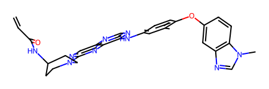

# Core


<!-- WARNING: THIS FILE WAS AUTOGENERATED! DO NOT EDIT! -->

## Setup

## Compound Datahub

------------------------------------------------------------------------

<a
href="https://github.com/sky1ove/kdock/blob/main/kdock/data/core.py#L30"
target="_blank" style="float:right; font-size:smaller">source</a>

### Data

>  Data ()

*A class for fetching various datasets.*

### Collins lab dataset

Publication list is available on the [lab
page](https://www.collinslab.mit.edu/publications-1)

------------------------------------------------------------------------

### Data.collins.get_antibiotics_2k

>  Data.collins.get_antibiotics_2k ()

*Antibiotics dataset of 50 µM 2,560 compounds screening in E. coli K12
BW25113. 2,335 unique compounds after deduplicated. Table S1B from 2020
Cell: A Deep Learning Approach to Antibiotic Discovery.*

------------------------------------------------------------------------

### Data.collins.get_antibiotics_39k

>  Data.collins.get_antibiotics_39k ()

*Antibiotics dataset of 50 µM 39,128 compounds screening in E. coli K12
BW25113. Supplementary dataset EV1 from 2022 Molecular Systems Biology:
Benchmarking AlphaFold-enabled molecular docking predictions for
antibiotic discovery.*

------------------------------------------------------------------------

### Data.collins.get_antibiotics_enzyme

>  Data.collins.get_antibiotics_enzyme ()

*Antibiotics enzymatic inhibition dataset of 100 µM 218 compounds and 12
essential proteins in E. coli K12 BW25113. Flattened benchmark
dataset/Supplementary EV4 from 2022 Molecular Systems Biology:
Benchmarking AlphaFold-enabled molecular docking predictions for
antibiotic discovery.*

### Kras inhibitors

------------------------------------------------------------------------

### Data.kras.get_mirati_g12d_raw

>  Data.kras.get_mirati_g12d_raw ()

*Raw G12D dataset from the paper and patents without deduplication*

------------------------------------------------------------------------

### Data.kras.get_mirati_g12d

>  Data.kras.get_mirati_g12d ()

*Deduplicated G12D dataset from the mirati paper and patents.*

------------------------------------------------------------------------

### Data.kras.get_seq

>  Data.kras.get_seq ()

*Protein sequence of human KRAS and its mutants G12D and G12C.*

## Uniprot sequence

------------------------------------------------------------------------

<a
href="https://github.com/sky1ove/kdock/blob/main/kdock/data/core.py#L91"
target="_blank" style="float:right; font-size:smaller">source</a>

### get_uniprot_seq

>  get_uniprot_seq (uniprot_id)

*Queries the UniProt database to retrieve the protein sequence for a
given UniProt ID.*

``` python
get_uniprot_seq('P04626')
```

    'MELAALCRWGLLLALLPPGAASTQVCTGTDMKLRLPASPETHLDMLRHLYQGCQVVQGNLELTYLPTNASLSFLQDIQEVQGYVLIAHNQVRQVPLQRLRIVRGTQLFEDNYALAVLDNGDPLNNTTPVTGASPGGLRELQLRSLTEILKGGVLIQRNPQLCYQDTILWKDIFHKNNQLALTLIDTNRSRACHPCSPMCKGSRCWGESSEDCQSLTRTVCAGGCARCKGPLPTDCCHEQCAAGCTGPKHSDCLACLHFNHSGICELHCPALVTYNTDTFESMPNPEGRYTFGASCVTACPYNYLSTDVGSCTLVCPLHNQEVTAEDGTQRCEKCSKPCARVCYGLGMEHLREVRAVTSANIQEFAGCKKIFGSLAFLPESFDGDPASNTAPLQPEQLQVFETLEEITGYLYISAWPDSLPDLSVFQNLQVIRGRILHNGAYSLTLQGLGISWLGLRSLRELGSGLALIHHNTHLCFVHTVPWDQLFRNPHQALLHTANRPEDECVGEGLACHQLCARGHCWGPGPTQCVNCSQFLRGQECVEECRVLQGLPREYVNARHCLPCHPECQPQNGSVTCFGPEADQCVACAHYKDPPFCVARCPSGVKPDLSYMPIWKFPDEEGACQPCPINCTHSCVDLDDKGCPAEQRASPLTSIISAVVGILLVVVLGVVFGILIKRRQQKIRKYTMRRLLQETELVEPLTPSGAMPNQAQMRILKETELRKVKVLGSGAFGTVYKGIWIPDGENVKIPVAIKVLRENTSPKANKEILDEAYVMAGVGSPYVSRLLGICLTSTVQLVTQLMPYGCLLDHVRENRGRLGSQDLLNWCMQIAKGMSYLEDVRLVHRDLAARNVLVKSPNHVKITDFGLARLLDIDETEYHADGGKVPIKWMALESILRRRFTHQSDVWSYGVTVWELMTFGAKPYDGIPAREIPDLLEKGERLPQPPICTIDVYMIMVKCWMIDSECRPRFRELVSEFSRMARDPQRFVVIQNEDLGPASPLDSTFYRSLLEDDDMGDLVDAEEYLVPQQGFFCPDPAPGAGGMVHHRHRSSSTRSGGGDLTLGLEPSEEEAPRSPLAPSEGAGSDVFDGDLGMGAAKGLQSLPTHDPSPLQRYSEDPTVPLPSETDGYVAPLTCSPQPEYVNQPDVRPQPPSPREGPLPAARPAGATLERPKTLSPGKNGVVKDVFAFGGAVENPEYLTPQGGAAPQPHPPPAFSPAFDNLYYWDQDPPERGAPPSTFKGTPTAENPEYLGLDVPV'

------------------------------------------------------------------------

<a
href="https://github.com/sky1ove/kdock/blob/main/kdock/data/core.py#L108"
target="_blank" style="float:right; font-size:smaller">source</a>

### get_uniprot_features

>  get_uniprot_features (uniprot_id)

*Given uniprot_id, get specific region for uniprot features.*

``` python
get_uniprot_features('P04626')[:3]
```

    [{'type': 'Signal',
      'location': {'start': {'value': 1, 'modifier': 'EXACT'},
       'end': {'value': 22, 'modifier': 'EXACT'}},
      'description': '',
      'evidences': [{'evidenceCode': 'ECO:0000255'}]},
     {'type': 'Chain',
      'location': {'start': {'value': 23, 'modifier': 'EXACT'},
       'end': {'value': 1255, 'modifier': 'EXACT'}},
      'description': 'Receptor tyrosine-protein kinase erbB-2',
      'featureId': 'PRO_0000016669'},
     {'type': 'Topological domain',
      'location': {'start': {'value': 23, 'modifier': 'EXACT'},
       'end': {'value': 652, 'modifier': 'EXACT'}},
      'description': 'Extracellular',
      'evidences': [{'evidenceCode': 'ECO:0000255'}]}]

------------------------------------------------------------------------

<a
href="https://github.com/sky1ove/kdock/blob/main/kdock/data/core.py#L123"
target="_blank" style="float:right; font-size:smaller">source</a>

### get_uniprot_kd

>  get_uniprot_kd (uniprot_id)

*Get kinase domain sequences based on UniProt ID.*

``` python
get_uniprot_kd('P04626')
```

    [{'uniprot_id': 'P04626',
      'type': 'Domain',
      'start': 720,
      'end': 987,
      'description': 'Protein kinase',
      'sequence': 'LRKVKVLGSGAFGTVYKGIWIPDGENVKIPVAIKVLRENTSPKANKEILDEAYVMAGVGSPYVSRLLGICLTSTVQLVTQLMPYGCLLDHVRENRGRLGSQDLLNWCMQIAKGMSYLEDVRLVHRDLAARNVLVKSPNHVKITDFGLARLLDIDETEYHADGGKVPIKWMALESILRRRFTHQSDVWSYGVTVWELMTFGAKPYDGIPAREIPDLLEKGERLPQPPICTIDVYMIMVKCWMIDSECRPRFRELVSEFSRMARDPQRFV'}]

------------------------------------------------------------------------

<a
href="https://github.com/sky1ove/kdock/blob/main/kdock/data/core.py#L146"
target="_blank" style="float:right; font-size:smaller">source</a>

### get_uniprot_type

>  get_uniprot_type (uniprot_id, type_='Signal')

*Get region sequences based on UniProt ID features.*

``` python
get_uniprot_type('P04626','Signal') # signal peptide
```

    [{'uniprot_id': 'P04626',
      'type': 'Signal',
      'start': 1,
      'end': 22,
      'description': '',
      'sequence': 'MELAALCRWGLLLALLPPGAAS'}]

``` python
get_uniprot_type('P04626','Transmembrane') # tm domain
```

    [{'uniprot_id': 'P04626',
      'type': 'Transmembrane',
      'start': 653,
      'end': 675,
      'description': 'Helical',
      'sequence': 'SIISAVVGILLVVVLGVVFGILI'}]

## Mutate sequence

------------------------------------------------------------------------

<a
href="https://github.com/sky1ove/kdock/blob/main/kdock/data/core.py#L169"
target="_blank" style="float:right; font-size:smaller">source</a>

### mutate

>  mutate (seq, *mutations, verbose=True)

*Apply mutations to a protein sequence.*

<table>
<thead>
<tr>
<th></th>
<th><strong>Type</strong></th>
<th><strong>Default</strong></th>
<th><strong>Details</strong></th>
</tr>
</thead>
<tbody>
<tr>
<td>seq</td>
<td></td>
<td></td>
<td>protein sequence</td>
</tr>
<tr>
<td>mutations</td>
<td>VAR_POSITIONAL</td>
<td></td>
<td>e.g., E709A</td>
</tr>
<tr>
<td>verbose</td>
<td>bool</td>
<td>True</td>
<td></td>
</tr>
</tbody>
</table>

``` python
seq = get_uniprot_seq('P04626')
mut_seq = mutate(seq,'M1A','E2S')
mut_seq
```

    Converted: M1A
    Converted: E2S

    'ASLAALCRWGLLLALLPPGAASTQVCTGTDMKLRLPASPETHLDMLRHLYQGCQVVQGNLELTYLPTNASLSFLQDIQEVQGYVLIAHNQVRQVPLQRLRIVRGTQLFEDNYALAVLDNGDPLNNTTPVTGASPGGLRELQLRSLTEILKGGVLIQRNPQLCYQDTILWKDIFHKNNQLALTLIDTNRSRACHPCSPMCKGSRCWGESSEDCQSLTRTVCAGGCARCKGPLPTDCCHEQCAAGCTGPKHSDCLACLHFNHSGICELHCPALVTYNTDTFESMPNPEGRYTFGASCVTACPYNYLSTDVGSCTLVCPLHNQEVTAEDGTQRCEKCSKPCARVCYGLGMEHLREVRAVTSANIQEFAGCKKIFGSLAFLPESFDGDPASNTAPLQPEQLQVFETLEEITGYLYISAWPDSLPDLSVFQNLQVIRGRILHNGAYSLTLQGLGISWLGLRSLRELGSGLALIHHNTHLCFVHTVPWDQLFRNPHQALLHTANRPEDECVGEGLACHQLCARGHCWGPGPTQCVNCSQFLRGQECVEECRVLQGLPREYVNARHCLPCHPECQPQNGSVTCFGPEADQCVACAHYKDPPFCVARCPSGVKPDLSYMPIWKFPDEEGACQPCPINCTHSCVDLDDKGCPAEQRASPLTSIISAVVGILLVVVLGVVFGILIKRRQQKIRKYTMRRLLQETELVEPLTPSGAMPNQAQMRILKETELRKVKVLGSGAFGTVYKGIWIPDGENVKIPVAIKVLRENTSPKANKEILDEAYVMAGVGSPYVSRLLGICLTSTVQLVTQLMPYGCLLDHVRENRGRLGSQDLLNWCMQIAKGMSYLEDVRLVHRDLAARNVLVKSPNHVKITDFGLARLLDIDETEYHADGGKVPIKWMALESILRRRFTHQSDVWSYGVTVWELMTFGAKPYDGIPAREIPDLLEKGERLPQPPICTIDVYMIMVKCWMIDSECRPRFRELVSEFSRMARDPQRFVVIQNEDLGPASPLDSTFYRSLLEDDDMGDLVDAEEYLVPQQGFFCPDPAPGAGGMVHHRHRSSSTRSGGGDLTLGLEPSEEEAPRSPLAPSEGAGSDVFDGDLGMGAAKGLQSLPTHDPSPLQRYSEDPTVPLPSETDGYVAPLTCSPQPEYVNQPDVRPQPPSPREGPLPAARPAGATLERPKTLSPGKNGVVKDVFAFGGAVENPEYLTPQGGAAPQPHPPPAFSPAFDNLYYWDQDPPERGAPPSTFKGTPTAENPEYLGLDVPV'

------------------------------------------------------------------------

<a
href="https://github.com/sky1ove/kdock/blob/main/kdock/data/core.py#L193"
target="_blank" style="float:right; font-size:smaller">source</a>

### compare_seq

>  compare_seq (original_seq, mutated_seq)

*Compare original and mutated sequences.*

``` python
compare_seq(seq,mut_seq)
```

    Differences found at positions:
      Position 1: M → A
      Position 2: E → S

## Copy files

Using `list(Path('files').rglob('*.pdb'))` will get all the pdb files of
subfolders. Here we define a function that can limit the depth of
search.

------------------------------------------------------------------------

<a
href="https://github.com/sky1ove/kdock/blob/main/kdock/data/core.py#L210"
target="_blank" style="float:right; font-size:smaller">source</a>

### rglob

>  rglob (path, pattern, max_depth)

*Get a file list given folder depths*

``` python
file_list = list(rglob('files','*.pdb',1))
file_list
```

    [Path('/teamspace/studios/this_studio/kdock/nbs/data/files/7OFF.pdb'),
     Path('/teamspace/studios/this_studio/kdock/nbs/data/files/7OFF_lig.pdb'),
     Path('/teamspace/studios/this_studio/kdock/nbs/data/files/7OFF_receptor.pdb')]

------------------------------------------------------------------------

<a
href="https://github.com/sky1ove/kdock/blob/main/kdock/data/core.py#L218"
target="_blank" style="float:right; font-size:smaller">source</a>

### copy_files

>  copy_files (file_list, dest_dir)

*Copy a list of files to the destination directory, or zip them if
dest_dir ends with .zip.*

``` python
# copy_files(file_list,'files/protein.zip') # support zip
copy_files(file_list,'files/protein')
```

    Copied 3 files to files/protein

## Conformer

------------------------------------------------------------------------

<a
href="https://github.com/sky1ove/kdock/blob/main/kdock/data/core.py#L236"
target="_blank" style="float:right; font-size:smaller">source</a>

### rdkit_conformer

>  rdkit_conformer (SMILES, output=None, method='ETKDG', visualize=True,
>                       seed=3)

*Gemerate 3D conformers from SMILES*

<table>
<colgroup>
<col style="width: 6%" />
<col style="width: 25%" />
<col style="width: 34%" />
<col style="width: 34%" />
</colgroup>
<thead>
<tr>
<th></th>
<th><strong>Type</strong></th>
<th><strong>Default</strong></th>
<th><strong>Details</strong></th>
</tr>
</thead>
<tbody>
<tr>
<td>SMILES</td>
<td></td>
<td></td>
<td>SMILES string</td>
</tr>
<tr>
<td>output</td>
<td>NoneType</td>
<td>None</td>
<td>file “.sdf” to be saved</td>
</tr>
<tr>
<td>method</td>
<td>str</td>
<td>ETKDG</td>
<td>Optimization method, can be ‘UFF’, ‘MMFF’ or ‘ETKDGv3’</td>
</tr>
<tr>
<td>visualize</td>
<td>bool</td>
<td>True</td>
<td>whether or not to visualize the compound</td>
</tr>
<tr>
<td>seed</td>
<td>int</td>
<td>3</td>
<td>randomness of the 3D conformation</td>
</tr>
</tbody>
</table>

``` python
rdkit_conformer('CC1=C(C=CC(=C1)NC2=NC=NC3=CN=C(N=C32)N4CCC(CC4)NC(=O)C=C)OC5=CC6=C(C=C5)N(C=N6)C')
```



## Get receptor and ligand from pdb

------------------------------------------------------------------------

<a
href="https://github.com/sky1ove/kdock/blob/main/kdock/data/core.py#L279"
target="_blank" style="float:right; font-size:smaller">source</a>

### get_rec_lig

>  get_rec_lig (pdb_id:str, lig_id:str, out_dir='.')

*Download pdb and extract receptor and ligand from a PDB ID.*

<table>
<thead>
<tr>
<th></th>
<th><strong>Type</strong></th>
<th><strong>Default</strong></th>
<th><strong>Details</strong></th>
</tr>
</thead>
<tbody>
<tr>
<td>pdb_id</td>
<td>str</td>
<td></td>
<td>pdb id for download</td>
</tr>
<tr>
<td>lig_id</td>
<td>str</td>
<td></td>
<td>ligand id shown on the protein page</td>
</tr>
<tr>
<td>out_dir</td>
<td>str</td>
<td>.</td>
<td>directory path to save pdb files</td>
</tr>
</tbody>
</table>

``` python
rec_path,lig_path = get_rec_lig('7OFF','VCB','files')
rec_path,lig_path
```

    7OFF.pdb is detected!

    ('/teamspace/studios/this_studio/kdock/nbs/data/files/7OFF_receptor.pdb',
     '/teamspace/studios/this_studio/kdock/nbs/data/files/7OFF_lig.sdf')

## Get ligand box

------------------------------------------------------------------------

<a
href="https://github.com/sky1ove/kdock/blob/main/kdock/data/core.py#L323"
target="_blank" style="float:right; font-size:smaller">source</a>

### get_box

>  get_box (sdf_file, autobox_add=4.0, tolist=False)

*Get the box coordinates of ligand.sdf; mimic GNINA’s –autobox_ligand
behavior.*

``` python
box = get_box(lig_path)
box
```

    {'center_x': 38.848,
     'center_y': -26.77,
     'center_z': 10.419,
     'size_x': 14.652,
     'size_y': 8.942,
     'size_z': 12.509}

``` python
box_list = get_box(lig_path,tolist=True)
box_list
```

    [38.848, -26.77, 10.419, 14.652, 8.942, 12.509]

------------------------------------------------------------------------

<a
href="https://github.com/sky1ove/kdock/blob/main/kdock/data/core.py#L349"
target="_blank" style="float:right; font-size:smaller">source</a>

### tanimoto

>  tanimoto (df, smiles_col='SMILES', id_col='ID', target_col=None,
>                radius=2)

*Calculates the Tanimoto similarity scores between all pairs of
molecules in a pandas DataFrame.*

<table>
<colgroup>
<col style="width: 6%" />
<col style="width: 25%" />
<col style="width: 34%" />
<col style="width: 34%" />
</colgroup>
<thead>
<tr>
<th></th>
<th><strong>Type</strong></th>
<th><strong>Default</strong></th>
<th><strong>Details</strong></th>
</tr>
</thead>
<tbody>
<tr>
<td>df</td>
<td></td>
<td></td>
<td>df with SMILES and ID columns</td>
</tr>
<tr>
<td>smiles_col</td>
<td>str</td>
<td>SMILES</td>
<td>colname of SMILES</td>
</tr>
<tr>
<td>id_col</td>
<td>str</td>
<td>ID</td>
<td>colname of compound ID</td>
</tr>
<tr>
<td>target_col</td>
<td>NoneType</td>
<td>None</td>
<td>colname of compound values (e.g., IC50)</td>
</tr>
<tr>
<td>radius</td>
<td>int</td>
<td>2</td>
<td>radius of the Morgan fingerprint.</td>
</tr>
</tbody>
</table>

``` python
df = Data.kras.get_mirati_g12d_raw()[['ID','SMILES','IC50']]
df = df.dropna(subset= 'IC50').reset_index(drop=True)
```

``` python
df.head()
```

<div>
<style scoped>
    .dataframe tbody tr th:only-of-type {
        vertical-align: middle;
    }
&#10;    .dataframe tbody tr th {
        vertical-align: top;
    }
&#10;    .dataframe thead th {
        text-align: right;
    }
</style>

<table class="dataframe" data-quarto-postprocess="true" data-border="1">
<thead>
<tr style="text-align: right;">
<th data-quarto-table-cell-role="th"></th>
<th data-quarto-table-cell-role="th">ID</th>
<th data-quarto-table-cell-role="th">SMILES</th>
<th data-quarto-table-cell-role="th">IC50</th>
</tr>
</thead>
<tbody>
<tr>
<td data-quarto-table-cell-role="th">0</td>
<td>US_1</td>
<td>CN1CCC[C@H]1COc1nc(N2CC3CCC(C2)N3)c2cnc(cc2n1)...</td>
<td>124.7</td>
</tr>
<tr>
<td data-quarto-table-cell-role="th">1</td>
<td>US_2</td>
<td>CN1CCC[C@H]1COc1nc(N2CC3CCC(C2)N3)c2cnc(c(F)c2...</td>
<td>2.7</td>
</tr>
<tr>
<td data-quarto-table-cell-role="th">2</td>
<td>US_3</td>
<td>Cn1ccnc1CCOc1nc(N2CC3CCC(C2)N3)c2cnc(c(F)c2n1)...</td>
<td>9.5</td>
</tr>
<tr>
<td data-quarto-table-cell-role="th">3</td>
<td>US_4</td>
<td>Oc1cc(-c2ncc3c(nc(OCCc4ccccn4)nc3c2F)N2CC3CCC(...</td>
<td>496.2</td>
</tr>
<tr>
<td data-quarto-table-cell-role="th">4</td>
<td>US_5</td>
<td>Cn1nccc1COc1nc(N2CC3CCC(C2)N3)c2cnc(c(F)c2n1)-...</td>
<td>722.9</td>
</tr>
</tbody>
</table>

</div>

``` python
# result = tanimoto(df.head(), target_col = 'IC50')
```

## End
